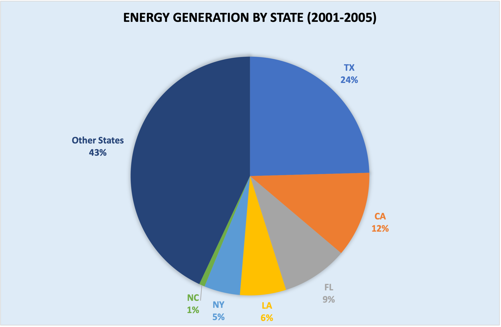
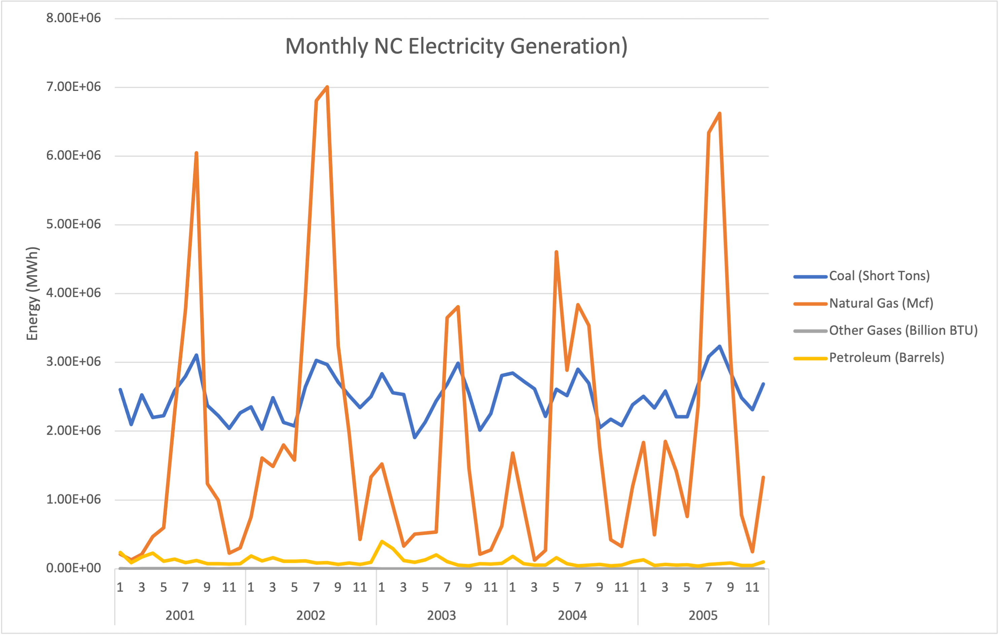
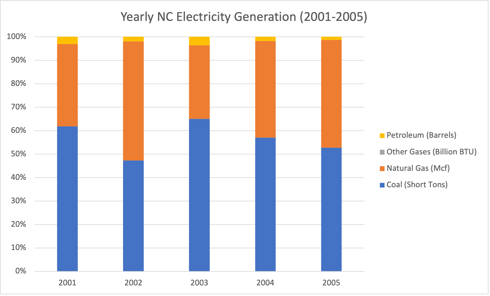
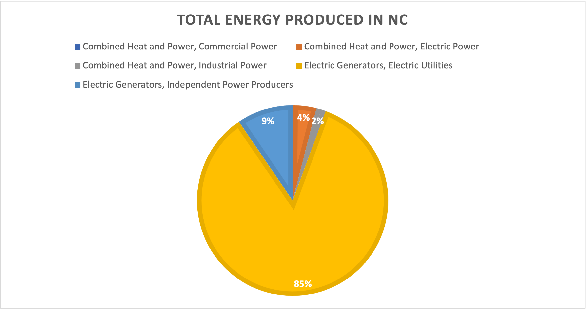
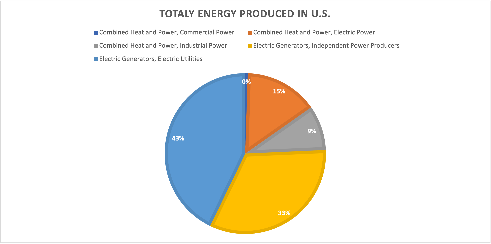
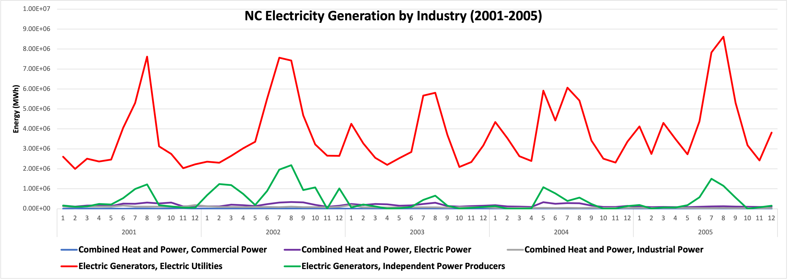
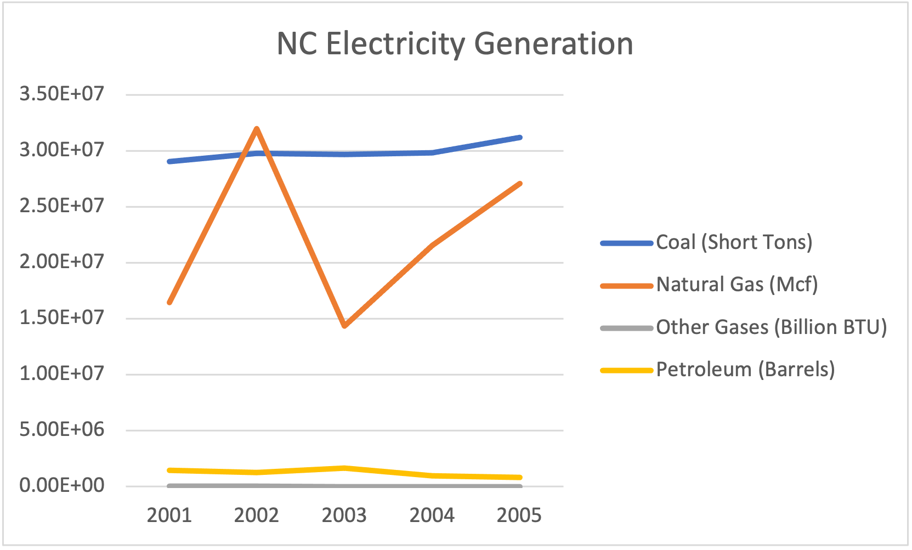

# Electricity Generation in NC from 2001-2005
North Carolina, like the rest of the United States, produces large amounts of electricity every year for various purposes and from a variety of sources. Understanding which industries produce this energy and from what energy sources provides incite into how the current electric industry in NC came to be. The following project analyzes electrical energy generation by state from 2001-2005. A future project will add data from the year 2006-2020 so that long-term trends can be determined.

## Electricity Generation in NC

NC produced 1% of the electricity generated in the United States from 2001-2006. Texas and California together produced 36%, or 36 times that of NC. The difference between these states has to do with size and population density - NC is largely composed of farmland and mountains, with relatively small cities compared to those in TX and CA. TX has the largest production by state because of the high demand from private companies in the state [(1)](https://comptroller.texas.gov/economy/fiscal-notes/2020/august/ercot.php). 

 

The line chart shows that, for coal and natural gas, NC produced the majority of its energy in the early Fall, and produces relatively little for the rest of the year. In other words, an oscillation occurs. Perhaps a large bulk of the electricity is immediately stored during the Fall and used during the winter when the demand is highest? This is just a conjecture and needs to be backed by proper sources. Natural gas has the greatest fluctuation in its energy production. Nevertheless, when analyzing the bar chart below, most energy was derived from coal. The exception is 2002, where energy from natural gas exceeded that of coal by a slight margin. It should also be noted that petroleum produced a significant, though relatively small amount of electricity to the electrical industry - petroleum is used more for transportation than electricity production.   

## By Industry

Electric Generators for utilities (private companies that distribute energy for utility needs) generated the most electricity out of all industries in NC (see chart below) at 85%. Adding independent power producers, a total of 94% of energy was produced by electric generators in NC. In contrast, the U.S. at large produces 76% its electricity from generators, and relies on Combined Heat and Power (industry that provides heating to buildings and infrastructure) for the other 24%. NC is a relatively warm state, so it is intuitive that the state would have less dependence on heating compared to the rest of the country.

The line chart below shows that the fluctuation in energy production in NC is a result of the fluctuation in production by the electric generators for utilities. The chart also emphasizes that electric generators are the primary means of energy production in NC. 

## Final Thoughts

In NC from 2001-2005, energy production oscillated by the time of the year. In the months of July and August, production skyrocketed, then plummeted in September, only to skyrocket again in July of next year. More research must be done to find out why this is. One guess is that the energy needs to be stored so that it is ready to be used in the winter months, where the need for indoor heating increases. 

Electric generators for utilities produced the vast majority of the energy in NC, and the same goes for the U.S. overall. The majority of electricity in NC is produced by coal, with natural gas being a close second. However, natural gas showed an increase in energy generation from 2003 to 2005 while coal remained steady, as seen in the line chart below. The energy generation of natural gas, nevertheless, is too unstable in the these 5 years to make any projections.

There was an unusual use of natural gas in 2002, making it the most used energy source that year in NC. More research must be done to determine why the energy needs of the state in 2002 were higher than the other years. 

Additional data must be collected since the dataset is limited to the years of 2001-2005. With more data, a regression analysis could be performed to see if the energy production from last year (2021) could be predicted.   

